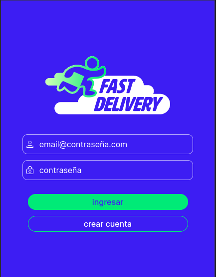
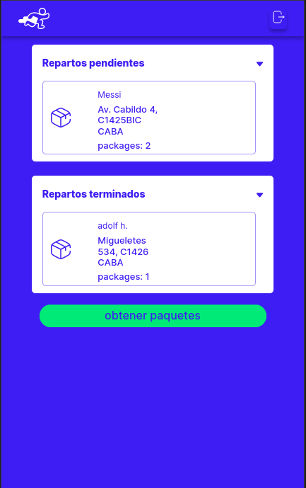
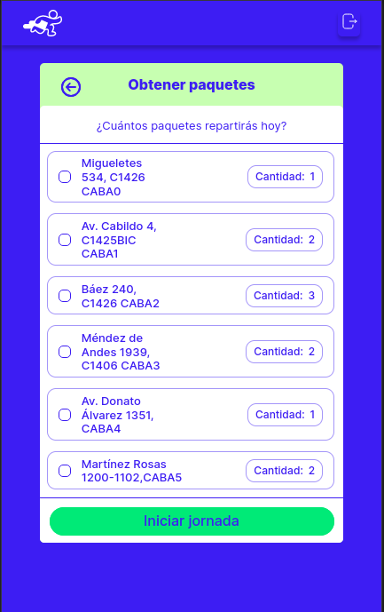
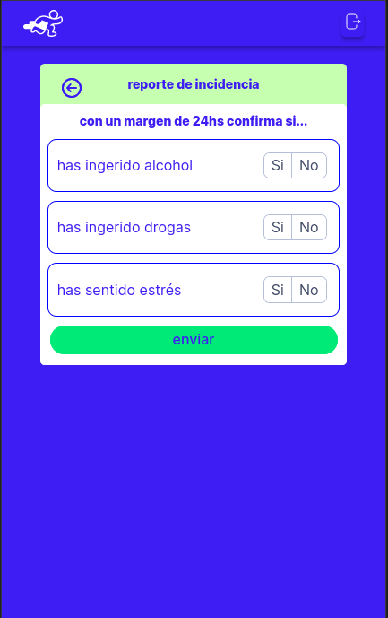
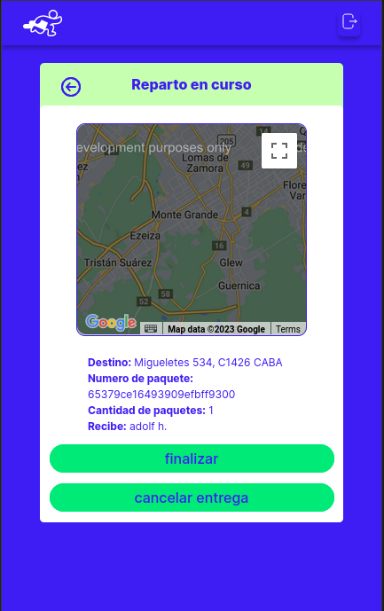
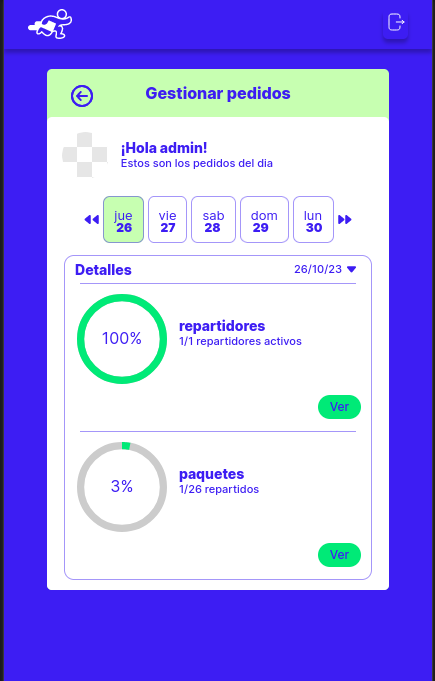
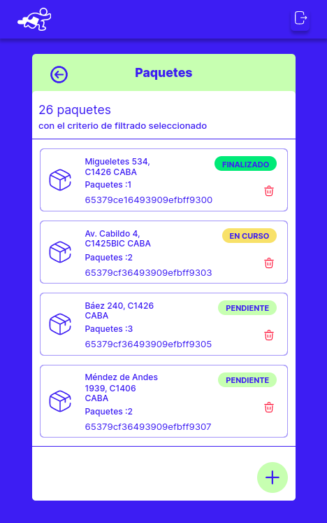
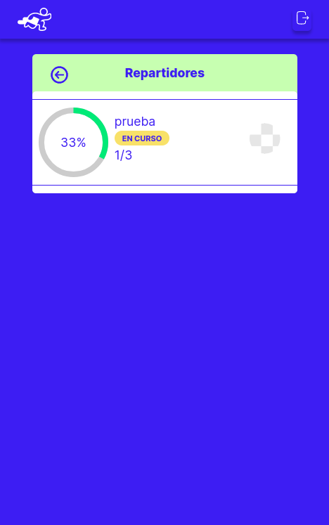
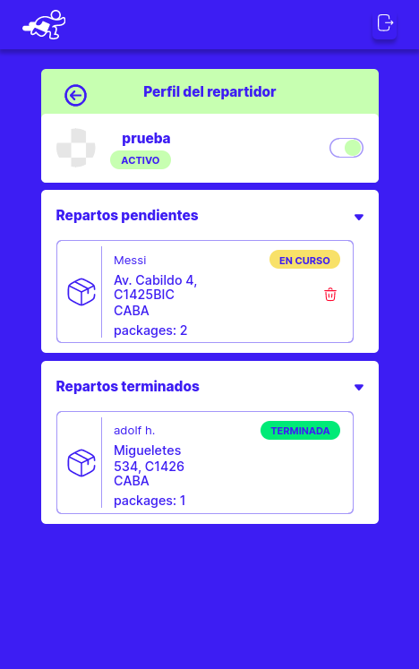

# Fast-Delivery-General
Fast Delivery Es Una Aplicacion Creada Para Una Empresa De Ultima Milla Con Cientos De Repartidores , A Travez De Esta App, La Empresa Podra Monitorear La Operación De Repartidores, Asignar O Reasignar Paquetes , Habilitar o Deshabilitar A Un Repartidor Para Repartir Paquetes, Ver Las Estadisticas Del Día o Añadir y Eliminar Paquetes Para Repartir

## Como Se Desarrollo
El Desarrollo Fue En Un Equipo De 4 Integrantes Organizandonos Con Trello y Trabajando Bajo La Metodologia SCRUM A Lo Largo De 3 Meses Donde Tuvimos Demos Semanales Para Mostrar Los Avanzes Del Proyecto 

## Vistas De Un Repartidor :
|||||

## Vistas De Un Administrador
||||

